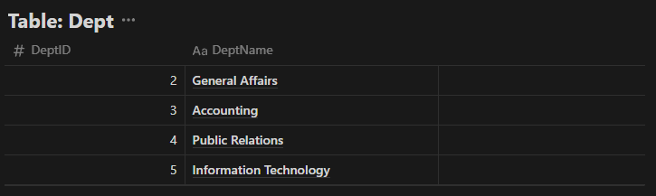
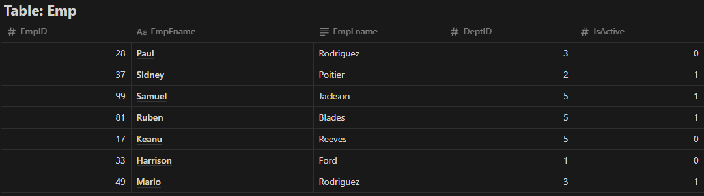

# DBA Challenge

This project is a hands-on database administration challenge designed to test your knowledge and skills in database management using one of the following platforms: MSSQL, PostgreSQL, MySQL, or Oracle DB.

## Overview

The challenge consists of creating, managing, and maintaining a database named **DBAChallenge** with specific tasks ranging from table creation to data manipulation, backups, and performance optimizations.

---

## Tasks and Requirements

### Task 1: Database Creation
- Create a database named **DBAChallenge**.

### Task 2: Table Creation
- Create the following tables:

    

    

### Task 3: Initial Backup
- Perform a full database backup, naming the file `BackupData1.bak`.

### Task 4: Data Insertion and Testing
- Insert data into the tables as provided in the attached screenshots.
- Test the data by:
  - Retrieving all columns from the **Emp** table.
  - Displaying the extended description for the `DeptID` field by joining the **Dept** table.

### Task 5: Log Backup
- Perform a second backup of the database, naming the file `BackupData2.bak`.

### Task 6: Schema Update and Data Modification
1. Add a new column `EmpMidInitial` (VARCHAR(1)) to the **Emp** table.
2. Set `EmpID` as the Primary Key for the **Emp** table.
3. Update data in the **Emp** table:
   - Set `EmpMidInitial` to 'D' for employees with the last name 'Rodriguez'.
   - Set `EmpMidInitial` to blank for all other employees.
4. Retrieve and display data by expanding the `DeptID` field with its full department name. Order the results by `EmpID`.

### Task 7: Log Backup
- Perform a third database backup, naming the file `BackupData3.bak`.

### Task 8: Index Creation
- Create a new non-clustered index on the **Emp** table with:
  - `EmpID` as index nodes.
  - `EmpFname`, `EmpMidInitial`, and `EmpLname` at the leaf level of the index.

### Task 9: Consistency Check
- Verify the database's consistency to ensure no errors are present.

### Task 10: Index Maintenance
- Defragment all indexes and primary keys.
- Recompute statistics.

### Task 11: Stored Procedure/Function
- Create a stored procedure or function (`SPList`) that:
  - Accepts no parameters.
  - Retrieves data from the **Emp** and **Dept** tables.
  - Expands the `DeptID` field to show its full department description.

### Task 12: Database Restoration
- Restore the database to **Database State 2** (as created in Task 5).

### Task 13: User Creation
- Create a read-only database user named `api-user`.

### Task 14: User Permission Update
- Alter the `api-user` to:
  - Have write privileges on the **Emp** table.
  - Have read-only privileges on the **Dept** table.

---

## Files
- **Backup Files**: `BackupData1.bak`, `BackupData2.bak`, `BackupData3.bak`

---

## How to Execute
1. Clone this repository and set up the database environment using one of the supported platforms.
2. Follow the tasks sequentially to complete the challenge.
3. Use the provided backup files for restoration steps when required.
